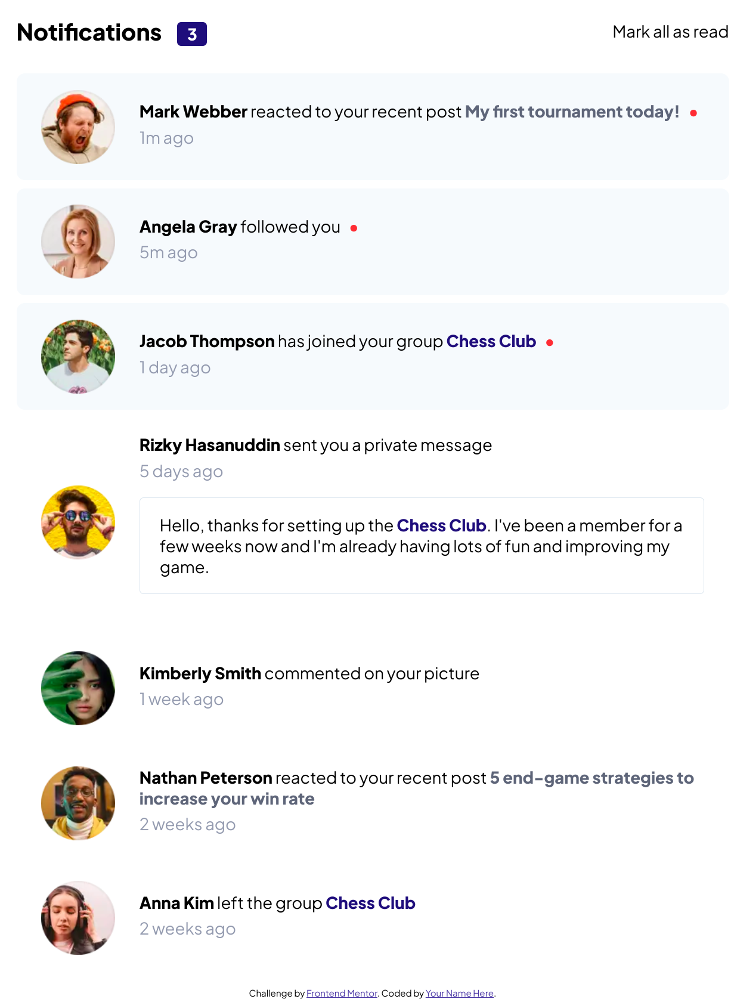

# Frontend Mentor - Notifications page solution

This is a solution to the [Notifications page challenge on Frontend Mentor](https://www.frontendmentor.io/challenges/notifications-page-DqK5QAmKbC).

## Table of contents

- [Overview](#overview)
  - [The challenge](#the-challenge)
  - [Screenshot](#screenshot)
  - [Links](#links)
- [My process](#my-process)
  - [Built with](#built-with)
- [Author](#author)

## Overview

### The challenge

Users should be able to:

- Distinguish between "unread" and "read" notifications
- Select "Mark all as read" to toggle the visual state of the unread notifications and set the number of unread messages to zero
- View the optimal layout for the interface depending on their device's screen size
- See hover and focus states for all interactive elements on the page

### Screenshot

## My process

I started by taking a look at the design and figure out which layout I should pick, then making up the HTML structure, importing assets in HTML and CSS (custom variables), then I have styled it from top to bottom.

Finally, I added the JavaScript code required for user interaction.

### Built with

- Semantic HTML5 markup
- CSS custom properties
- Flexbox
- BEM methodology
- JavaScript

## Author

- beacons.ai - [porobertdev](https://beacons.ai/porobertdev)
- Frontend Mentor - [@porobertdev](https://www.frontendmentor.io/profile/porobertdev)
- Twitter - [@porobertdev](https://www.twitter.com/porobertdev)
